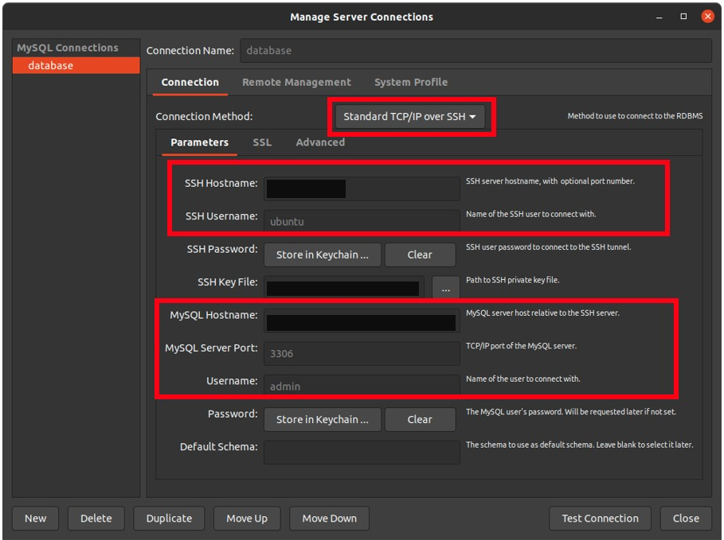

## Resources

This setup creates the following resources:

- VPC
- One public and one private subnet per AZ
- Routing tables for the subnets
- Internet Gateway for public subnets
- NAT gateways with attached Elastic IPs for the private subnet
- Four security groups
  - One that allows HTTP/HTTPS access
  - One that allows access to the specified container port – ECS task
  - One that allows access to the database
  - One to that rules the RDS
- An ALB + Target Group with listeners for port 80 and 443
- An ECR for the docker images
- Secrets necessary to application be executed
- An ECS cluster with a service and task definition to run docker containers from the ECR (incl. IAM execution role)
- Secret to store master user and password database
- An RDS database
  - Protected by a private VPC
  - Connected to application
- An EC2 instance like a bastion machine to connect the database
  - Because the database is in a private VPC, this approach is necessary

### Get Started building the infrastructure

- Install terraform
- Update `secrets.tfvars` with yours secrets, insert the values for your AWS access key and secrets. If you don't create your `secrets.tfvars`, don't worry. Terraform will interactively prompt you for missing variables later on. You can also create your `environment.tfvars` file to manage non-secret values for different environments or projects with the same infrastructure
- Execute `terraform init -input=false -backend-config=inputs/${ENVIRONMENT}/backend.tfvars`, it will initialize your local terraform and connect it to the state store, and it will download all the necessary providers
- Execute `terraform plan -var-file="inputs/${ENVIRONMENT}/secrets.tfvars" -var-file="inputs/${ENVIRONMENT}/variables.tfvars"`- this will calculate the changes terraform has to apply and creates a plan. If there are changes, you will see them. Check if any of the changes are expected, especially deletion of infrastructure.
- if everything looks good, you can execute the changes with `terraform plan -var-file="inputs/${ENVIRONMENT}/secrets.tfvars" -var-file="inputs/${ENVIRONMENT}/variables.tfvars"` and type `yes` after you saw what will be create by terraform.

### How to connect the database with bastion EC2

1 - Open MySQL Workbench.

2 - Create a new connection and configure details as displayed below.

3 - Make sure to select “Standard TCP/IP over SSH” for Connection method.

4 - Give EC2 public DNS endpoint to “SSL Hostname” field and “ubuntu” as “SSH Username”.

5 - Type sudo chmod 400 to change tem key permission. 

6 - Select key pair file (Of EC2 instance) from your PC in “SSH Key File” field.

7 - Give RDS Endpoint to “MySQL Hostname” field.

8 - Enter 3306 to “MySQL Server Port” field.

9 - Enter the admin username to the database.

10 - Click “Test Connection”.

11 - For more information see the wiki section of the scan2cloud channel.

10 - You will be prompted for the password which was generated during infra deploy. If everything went well, you should be able to get a secure and successful connection.

<!-- BEGIN_TF_DOCS -->
## Requirements

| Name | Version |
|------|---------|
|  [terraform](#requirement\_terraform) | >= 0.13.5 |

## Providers

No providers.

## Modules

| Name | Source | Version |
|------|--------|---------|
|  [admin-front](#module\_admin-front) | ./modules/s3 | n/a |
|  [alb](#module\_alb) | ./modules/alb | n/a |
|  [bastion-host](#module\_bastion-host) | ./modules/ec2 | n/a |
|  [db\_instance](#module\_db\_instance) | ./modules/rds | n/a |
|  [ecr](#module\_ecr) | ./modules/ecr | n/a |
|  [ecs](#module\_ecs) | ./modules/ecs | n/a |
|  [route53](#module\_route53) | ./modules/route53 | n/a |
|  [sec\_groups\_alb](#module\_sec\_groups\_alb) | ./modules/security-groups | n/a |
|  [sec\_groups\_bastion](#module\_sec\_groups\_bastion) | ./modules/security-groups | n/a |
|  [sec\_groups\_db\_access](#module\_sec\_groups\_db\_access) | ./modules/security-groups | n/a |
|  [sec\_groups\_ecs](#module\_sec\_groups\_ecs) | ./modules/security-groups | n/a |
|  [sec\_groups\_rds](#module\_sec\_groups\_rds) | ./modules/security-groups | n/a |
|  [secrets](#module\_secrets) | ./modules/secrets | n/a |
|  [vpc](#module\_vpc) | ./modules/vpc | n/a |

## Resources

No resources.

## Inputs

| Name | Description | Type | Default | Required |
|------|-------------|------|---------|:--------:|
|  [admin\_front\_bucket](#input\_admin\_front\_bucket) | Bucket name to host admin frontend | `string` | n/a | yes |
|  [app\_bucket](#input\_app\_bucket) | Bucket used by application previously created | `string` | n/a | yes |
|  [application](#input\_application) | the name of your application, e.g. "admincloud" | `string` | n/a | yes |
|  [application-secrets](#input\_application-secrets) | A map of secrets that is passed into the application. Formatted like ENV\_VAR = VALUE | `map(string)` | n/a | yes |
|  [availability\_zones](#input\_availability\_zones) | a comma-separated list of availability zones, defaults to all AZ of the region, if set to something other than the defaults, both private\_subnets and public\_subnets have to be defined as well | `list(string)` | n/a | yes |
|  [backend\_api\_path](#input\_backend\_api\_path) | Api path to redirect request to backend | `string` | n/a | yes |
|  [bastion\_ami](#input\_bastion\_ami) | AMI to use for the instance | `string` | n/a | yes |
|  [bastion\_key\_name](#input\_bastion\_key\_name) | The key name using to access the bastion instance | `string` | n/a | yes |
|  [cidr](#input\_cidr) | The CIDR block for the VPC. | `string` | n/a | yes |
|  [cloud\_watch\_stream](#input\_cloud\_watch\_stream) | Bucket to store cloudwatch logs | `string` | n/a | yes |
|  [container\_cpu](#input\_container\_cpu) | The number of cpu units used by the task | `number` | n/a | yes |
|  [container\_memory](#input\_container\_memory) | The amount (in MiB) of memory used by the task | `number` | n/a | yes |
|  [container\_port](#input\_container\_port) | The port where the Docker is exposed | `number` | n/a | yes |
|  [db\_allocated\_storage](#input\_db\_allocated\_storage) | The amount of allocated storage in gigabytes | `number` | n/a | yes |
|  [db\_engine](#input\_db\_engine) | The database engine | `string` | n/a | yes |
|  [db\_engine\_version](#input\_db\_engine\_version) | The running version of the database | `string` | n/a | yes |
|  [db\_instance\_class](#input\_db\_instance\_class) | The RDS instance class | `string` | n/a | yes |
|  [db\_password\_size](#input\_db\_password\_size) | The length of the string desired | `number` | n/a | yes |
|  [db\_port](#input\_db\_port) | The database port | `number` | n/a | yes |
|  [db\_root\_user](#input\_db\_root\_user) | Username for the master DB user | `string` | n/a | yes |
|  [db\_secrets\_keys](#input\_db\_secrets\_keys) | Keys for secrets to receive values during database creation | `list(string)` | n/a | yes |
|  [domain\_address](#input\_domain\_address) | The domain that will be registered the URL address on Route 53 | `string` | n/a | yes |
|  [environment](#input\_environment) | the name of your environment, e.g. "prod" | `string` | n/a | yes |
|  [http\_port](#input\_http\_port) | Port number for http traffic | `number` | n/a | yes |
|  [http\_protocol](#input\_http\_protocol) | Protocol to use for routing HTTP traffic to the targets. | `string` | n/a | yes |
|  [https\_port](#input\_https\_port) | Port number for https traffic | `number` | n/a | yes |
|  [https\_protocol](#input\_https\_protocol) | Protocol to use for routing HTTPS traffic to the targets. | `string` | n/a | yes |
|  [load\_balancer\_type](#input\_load\_balancer\_type) | The type of load balancer to create | `string` | n/a | yes |
|  [private\_subnets](#input\_private\_subnets) | a list of CIDRs for private subnets in your VPC, must be set if the cidr variable is defined, needs to have as many elements as there are availability zones | `list(string)` | n/a | yes |
|  [project](#input\_project) | Project name that application belongs | `string` | n/a | yes |
|  [public\_subnets](#input\_public\_subnets) | a list of CIDRs for public subnets in your VPC, must be set if the cidr variable is defined, needs to have as many elements as there are availability zones | `list(string)` | n/a | yes |
|  [region](#input\_region) | AWS region | `string` | n/a | yes |
|  [secrets\_recovery\_window](#input\_secrets\_recovery\_window) | Number of days that AWS Secrets Manager waits before it can delete the secret | `number` | n/a | yes |
|  [service\_desired\_count](#input\_service\_desired\_count) | Number of tasks running in parallel | `number` | n/a | yes |
|  [tg\_health\_check\_path](#input\_tg\_health\_check\_path) | Http path for task health check | `string` | n/a | yes |
|  [tg\_healthy\_threshold](#input\_tg\_healthy\_threshold) | Number of consecutive health checks successes required before considering an unhealthy target healthy. | `string` | n/a | yes |
|  [tg\_interval](#input\_tg\_interval) | Approximate amount of time, in seconds, between health checks of an individual target. | `string` | n/a | yes |
|  [tg\_matcher](#input\_tg\_matcher) | Response codes to use when checking for a healthy responses from a target. | `string` | n/a | yes |
|  [tg\_unhealthy\_threshold](#input\_tg\_unhealthy\_threshold) | Number of consecutive health check failures required before considering the target unhealthy | `string` | n/a | yes |
|  [timeout](#input\_timeout) | Amount of time, in seconds, during which no response means a failed health check. | `string` | n/a | yes |
|  [token\_remeber\_seconds](#input\_token\_remeber\_seconds) | Token time remeber | `number` | n/a | yes |
|  [token\_validity\_seconds](#input\_token\_validity\_seconds) | Token time validity | `number` | n/a | yes |
|  [tsl\_certificate\_arn](#input\_tsl\_certificate\_arn) | The ARN of the certificate that the ALB uses for https | `string` | n/a | yes |
|  [tsl\_certificatecloudfront](#input\_tsl\_certificatecloudfront) | The ARN of the certificate that the Cloudfront uses. | `string` | n/a | yes |
|  [xmpp\_port](#input\_xmpp\_port) | XMPP server port | `string` | n/a | yes |
|  [xmpp\_server\_host](#input\_xmpp\_server\_host) | XMPP server host address | `string` | n/a | yes |
|  [zone\_id](#input\_zone\_id) | ID from hosted zone | `string` | n/a | yes |

## Outputs

| Name | Description |
|------|-------------|
|  [Bastion\_public\_IP](#output\_Bastion\_public\_IP) | n/a |
|  [aws\_ecr\_repository\_url](#output\_aws\_ecr\_repository\_url) | n/a |
|  [cloudfront\_id](#output\_cloudfront\_id) | n/a |
|  [ecs\_cluster\_name](#output\_ecs\_cluster\_name) | n/a |
|  [service\_name](#output\_service\_name) | n/a |
|  [task\_name](#output\_task\_name) | n/a |
<!-- END_TF_DOCS -->